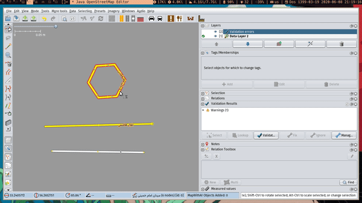
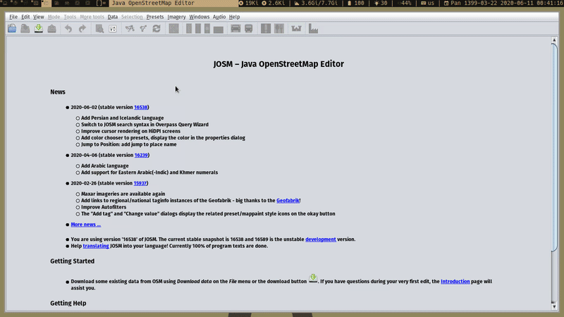

# JOSM Iran-Specific Rules 🇮🇷
Validation rules for JOSM to be applied in Iran.

## Installation :construction:
#### Download from validation list

- Go to Edit ↪ Preferences ↪ Validation (the 8rd button) ↪ Tag checker rules.
- Find and click "Iran-Specific rules" item in Available rules.
- Click blue arrow (▶) to move to Active rules.

## Contribute ✍
In order to to contribute in this project:
- You can either make an issue and explain how this project can be improved.
- Edit the files directly and pull request.

## Support this project 💰
Consider :star: this repo.

## License :page_facing_up:
This project is licensed under GNU GENERAL PUBLIC 3+ LICENSE
